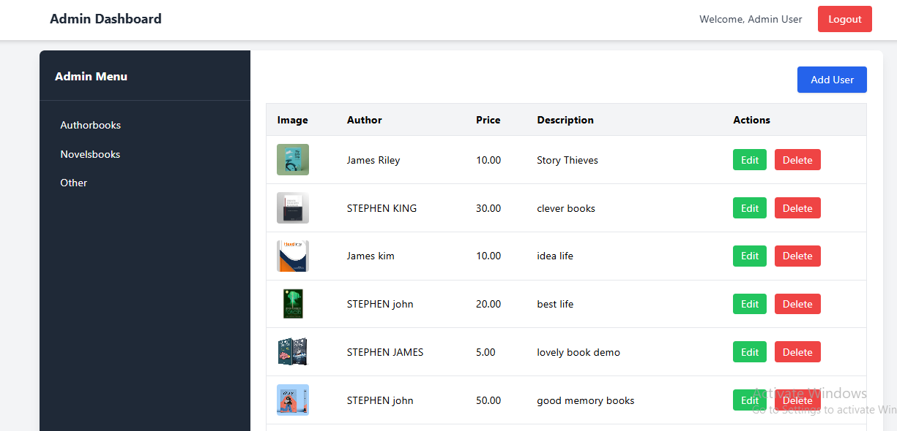
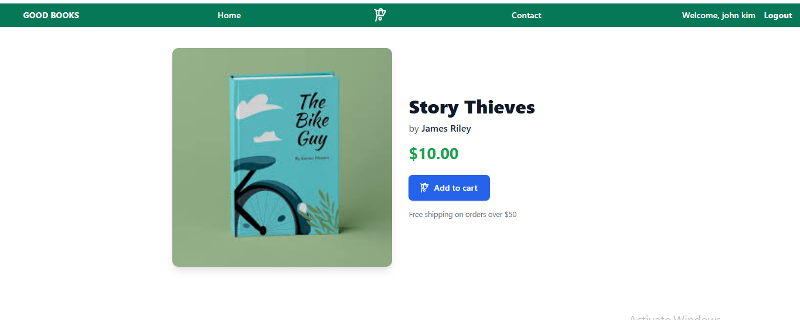
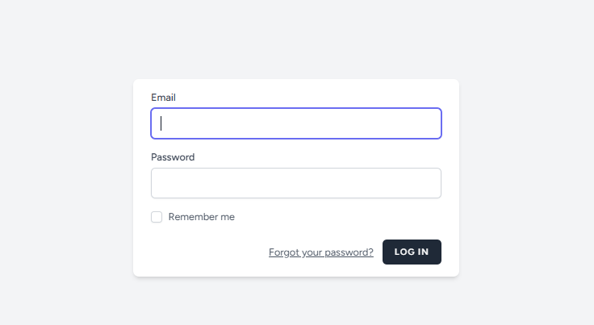

<p align="center">
  
</p>

# eCommerce Bookshop

A modern eCommerce bookstore web application built with Laravel and Tailwind CSS.

## 🚀 Features

- Browse and search for books
- Dynamic product detail pages
- Add to cart and manage cart items
- User authentication (registration & login)
- Responsive design for mobile and desktop
- **Admin dashboard to add, remove, and delete books**
- (Ready for future) Checkout and payment gateway integration
- Clean, maintainable codebase

## 📸 Screenshots

_
### Home page


### Product Details


### login


## Admin Panel


### Cart


## 🛠️ Tech Stack

- [Laravel](https://laravel.com/) (Backend Framework)
- [Tailwind CSS](https://tailwindcss.com/) (UI Styling)
- MySQL (Database)
- Blade (Templating Engine)

## 📝 Installation

1. **Clone the repository:**
    ```bash
    git clone https://github.com/m-coded/eCommerce-bookshop-.git
    cd eCommerce-bookshop-
    ```

2. **Install PHP & JavaScript dependencies:**
    ```bash
    composer install
    npm install
    npm run build    # or npm run dev for development
    ```

3. **Set up your environment:**
    ```bash
    cp .env.example .env
    php artisan key:generate
    ```
    - Edit `.env` to set up your database and other environment variables.

4. **Run migrations and (optionally) seed the database:**
    ```bash
    php artisan migrate --seed
    ```

5. **Start the development server:**
    ```bash
    php artisan serve
    ```
    - Visit [http://localhost:8000](http://localhost:8000) in your browser.

## 💡 Usage

- Register as a user and log in
- Browse available books
- View book details
- Add books to your cart and manage your cart
- **Admin: Add, edit, or delete books via the dashboard**

## 🚧 Roadmap

- Integrate Stripe or PayPal for checkout and payments
- Admin dashboard for advanced product and order management
- Order history and user profiles
- Product ratings and reviews

## 🤝 Contributing

Pull requests are welcome! For major changes, please open an issue first to discuss what you would like to change.

## 🛡️ License

This project is open source and available under the [MIT License](LICENSE).

## 👤 Author

- GitHub: [@m-coded](https://github.com/m-coded)
- Portfolio: _add your portfolio link here_
- Email: _add your contact email here_

---

> If you like this project, please ⭐ the repo and share it!
